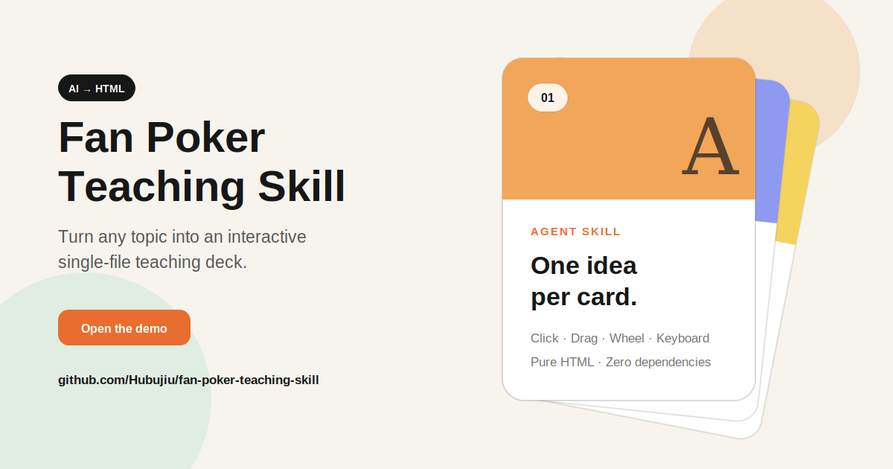

<div align="center">

# 🃏 Fan Poker Teaching Skill

**Turn any topic into an interactive lesson that clicks, drags, fans out, and recycles like a deck of cards.**

[](./SKILL.md)
[](./assets/fan-poker-base.html)
[](./package.json)
[](./LICENSE)

[Demo](#quick-demo) · [Install](#installation) · [中文](./README.md)



</div>

## Why this skill

Most AI-generated tutorials become long scrolling pages. This skill presents one focused idea at a time in a memorable single-sided fan deck.

- Click, drag, wheel, or use the keyboard to move through cards.
- The front card follows a full depth-aware path back into the deck.
- The animation engine and AI-editable content are deliberately separated.
- The output is one dependency-free HTML file with a transparent background.
- There is no toolbar, page counter, or bottom pagination competing with the lesson.
- Responsive sizing and reduced-motion support are built in.

## Quick demo

Open one of these files directly in a browser:

| File | Purpose |
|---|---|
| [`index.html`](./index.html) | Project landing page and live preview |
| [`examples/docker-lesson.html`](./examples/docker-lesson.html) | A realistic AI-authored lesson |
| [`assets/fan-poker-base.html`](./assets/fan-poker-base.html) | Clean reusable foundation |

## Installation

Clone the repository into the skills directory used by your Agent or CLI:

```bash
git clone https://github.com/Hubujiu/fan-poker-teaching-skill.git
```

Then ask your agent:

```text
Use the fan-poker-teaching-deck skill to create an interactive HTML lesson about deploying Docker on Linux.
```

A skill is a self-contained folder with a `SKILL.md` file plus optional assets and references. Exact skill-directory locations vary between clients.

## How it works

```text
Topic or source material
        ↓
Agent reads SKILL.md
        ↓
Copies assets/fan-poker-base.html
        ↓
Edits only cardData in the AI CONTENT ZONE
        ↓
Returns a runnable single-file HTML lesson
```

## Card authoring

Use simple fields for normal cards:

```js
{
  tag: "Step",
  title: "Check the Docker daemon",
  description: "Run docker version and confirm that both client and server information are present.",
  symbol: "03",
  accent: "#7dcfb6"
}
```

Use `html` for code blocks, lists, warnings, tables, and links. See [`references/card-data-schema.md`](./references/card-data-schema.md) for the complete schema and content-density guidance.

## External API

```js
window.fanPokerDeck.requestStep(1);   // next
window.fanPokerDeck.requestStep(-1);  // previous
window.fanPokerDeck.goTo(3);          // fourth card, shortest path
```

## Validation

No dependency installation is required:

```bash
npm test
```

The validator checks JavaScript syntax, required markers, non-empty card data, removed UI regressions, and the public control API.

## Contributing

Read [`CONTRIBUTING.md`](./CONTRIBUTING.md). Animation changes should include a visual explanation or preview. Lesson examples should remain accurate, focused, and readable.

## License

MIT © [Hubujiu](https://github.com/Hubujiu)

---

<div align="center">

**If this deck makes teaching a little more delightful, consider leaving a Star.** ⭐

</div>
